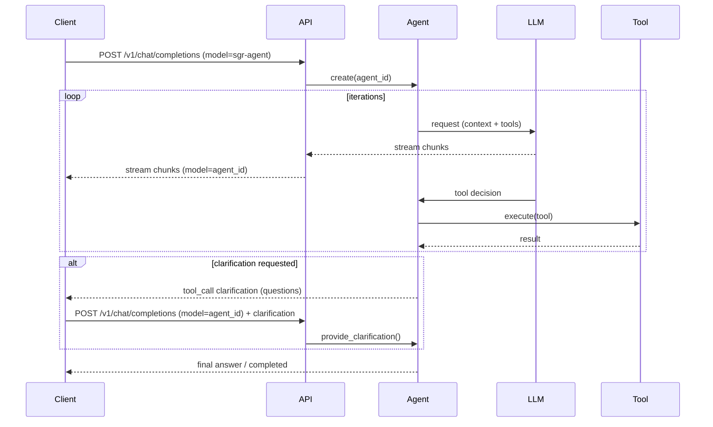

# Документ 1 — Текущая внутренняя логика SGR-Agent (ReAct / SGR)

> Цель документа: зафиксировать **текущую** архитектуру и алгоритмику работы SGR-Agent Core (как в апстрим-проекте), чтобы корректно перенести логику в новый проект с «долгоживущими» агентами.

---

## 1. Терминология (что за что отвечает)

### 1.1. Agent
В SGR Agent Core агент — это исполняемая сущность, которая работает циклом **Reasoning → Action Selection → Action Execution** (вариация ReAct). Базовый класс `BaseAgent` задаёт каркас цикла, а конкретные реализации определяют детали reasoning/выбора/вызова инструментов.

### 1.2. Tool
Tool (инструмент) — это исполняемый компонент, который агент вызывает для совершения действия (поиск, уточнение, генерация плана, создание отчёта и т. п.). В проекте инструменты реализованы как **Pydantic-модели** с `async __call__`, автоматически регистрируются в `ToolRegistry`.

### 1.3. Definition / Config
- **GlobalConfig** — единый (singleton) объект глобальных настроек.
- **AgentDefinition** — «шаблон» сборки агента: базовый класс агента + настройки + список инструментов.
- **AgentConfig** — результат наследования/объединения настроек (LLM/search/execution/prompts/MCP) для конкретного агента.

> Важно: AgentDefinition наследует параметры из GlobalConfig и переопределяет только указанные значения.

---

## 2. Базовый каркас исполнения: BaseAgent

### 2.1. Главный цикл (ReAct-like)
Упрощённо, исполнение в `BaseAgent` можно представить так:

```python
while agent.state not in FINISH_STATES:
    reasoning = await agent._reasoning_phase()
    action_tool = await agent._select_action_phase(reasoning)
    await agent._action_phase(action_tool)
```

**Ключевая мысль для переноса:** даже если в разных агент-классах (SGR/ToolCalling/Hybrid) «формально» фаз может быть две, семантически это тот же ReAct-цикл: модель принимает решение → выбирается инструмент → инструмент выполняется → результат добавляется в контекст/историю → цикл повторяется до финала.

### 2.2. Минимальный интерфейс, который переопределяют агенты
В `BaseAgent` выделены методы, влияющие на контекст и набор инструментов (важно для новой архитектуры с Tool Search):

- `_prepare_context()` — формирует список сообщений в формате OpenAI (system/user + история).
- `_prepare_tools()` — формирует список доступных tools (в виде OpenAI function-tool схем), с учётом лимитов/состояния.
- `_reasoning_phase()` — обращение к LLM для получения структурированного/неструктурированного «reasoning».
- `_select_action_phase()` — выбор конкретного tool.
- `_action_phase()` — выполнение tool и запись результата в контекст.
- `_execution_step()` — шаг, который может быть overridden для более сложных workflows.

### 2.3. Основные атрибуты агента
В рамках проекта агент, как правило, держит:

- `id` — уникальный идентификатор (используется в API и логах).
- `task` — целевая задача (или текущий запрос пользователя).
- `config` — AgentConfig (LLM, search, execution, prompts, mcp).
- `openai_client` — клиент к OpenAI-совместимому API.
- `_context` — runtime-контекст выполнения (состояния, счётчики, результат).
- `conversation` — история сообщений (assistant/tool сообщения добавляются по мере работы).
- `toolkit` — список классов инструментов (Type[BaseTool]).
- `streaming_generator` — генератор стриминга (OpenAI-like chunks).

---

## 3. Варианты агентов в текущей системе

SGR Agent Core включает несколько реализаций:

### 3.1. SGRAgent (Structured Output / Schema-Guided)
- reasoning возвращается в виде структурированного объекта, и «выбор инструмента» фактически делается внутри reasoning-ответа (через включённую схему tool).

### 3.2. ToolCallingAgent (Native Function Calling)
- явной reasoning-фазы нет (reasoning «внутри» LLM),
- инструмент выбирается через `tool_choice="required"`.

### 3.3. SGRToolCallingAgent (Hybrid)
- **ReasoningTool** используется как системный tool, чтобы получить явный reasoning,
- затем выбор инструмента — через function calling,
- далее стандартный action phase.

### 3.4. Research* агенты
Research-агенты добавляют «прикладной» deep-research workflow и динамическое управление toolset’ом (например, исключают WebSearchTool при превышении max_searches и т. п.).

---

## 4. Конфигурация: GlobalConfig → AgentDefinition → Agent

### 4.1. Иерархия и наследование
Система настроек построена на принципе расширения:
- дефолты фреймворка,
- поверх — ENV (.env),
- поверх — config.yaml,
- поверх — definitions yaml,
- поверх — agents.yaml,
- затем сборка AgentDefinition и создание конкретного Agent.

**Практическая ценность для переноса:** это почти готовая логика «шаблонов» (AgentDefinition). В новой архитектуре её нужно «поднять» на уровень отдельного сервиса и БД, добавив версионирование и runtime-инстансы.

### 4.2. GlobalConfig как singleton
Важно учитывать, что `GlobalConfig()` возвращает один и тот же объект, т. е. изменения распространяются глобально. В новой архитектуре (где будут шаблоны в БД) стоит избегать нежелательной «глобальной мутабельности»: GlobalConfig можно оставить как runtime-дефолты, но шаблоны хранить отдельно.

### 4.3. AgentConfig (ключевые секции)
Из примеров конфигурации видно, что AgentConfig включает:

- `llm`: `api_key`, `base_url`, `model`, `max_tokens`, `temperature`, `proxy`
- `search`: `tavily_api_key`, `tavily_api_base_url`, `max_searches`, `max_results`, `content_limit`
- `execution`: `max_iterations`, `max_clarifications`, `mcp_context_limit`, `logs_dir`, `reports_dir`
- `prompts`: system_prompt / initial_user_request / clarification_response (из файлов или строк)
- `mcp`: `mcpServers` (конфиг MCP серверов)

---

## 5. Tools: структура, категории и поведение

### 5.1. BaseTool
Базовый инструмент:
- Pydantic-модель
- авто-регистрация в ToolRegistry
- `async __call__(context, config, **kwargs)` — единая точка исполнения

### 5.2. Категории инструментов (в текущей документации)
Инструменты разделены на:
- **System Tools** (без них deep-research агент не функционирует полноценно)
- **Auxiliary Tools** (опциональные расширители возможностей)

#### System Tools (ядро deep-research)
- ReasoningTool
- FinalAnswerTool
- CreateReportTool
- ClarificationTool
- GeneratePlanTool
- AdaptPlanTool

#### Auxiliary Tools
- WebSearchTool
- ExtractPageContentTool

> Для нового проекта важно сохранить этот принцип: «минимальный системный набор» всегда доступен, а остальные инструменты выбираются/подключаются политикой.

### 5.3. Динамическая доступность инструментов (лимиты / дискриминаторы)
Текущая логика:
- после `max_iterations` остаются только CreateReportTool и FinalAnswerTool
- после `max_clarifications` убирается ClarificationTool
- после `max_searches` убирается WebSearchTool

Это реализуется на уровне `_prepare_tools()` (например, в Research-агентах) и является прототипом «дискриминаторов»/rules engine.

---

## 6. AgentContext и разговорная история

### 6.1. Context (runtime state)
Контекст хранит:
- `state` (INITED/RESEARCHING/WAITING_FOR_CLARIFICATION/COMPLETED/…)
- `iteration`
- `clarifications_used`
- `searches_used` (для research-агентов)
- `execution_result`
- `custom_context` (поле под любые пользовательские данные)

Инструменты дополняют контекст данными: источники (`sources`), план, результаты поиска, и т. д.

### 6.2. Conversation history (OpenAI format)
История сообщений поддерживает стандартный OpenAI формат:
- system / user / assistant / tool
- tool_calls в assistant-сообщении
- tool_call_id в tool-сообщении

Это ключевой формат для сохранения совместимости с OpenAI-like API.

---

## 7. Стриминг (OpenAI-like)

`streaming_generator` — модуль, который позволяет публиковать события агента и отдавать результат в виде OpenAI-совместимого стрима (SSE). Агента можно читать как async iterator.

---

## 8. API-сервис (FastAPI) и жизненный цикл агента в текущей системе

### 8.1. OpenAI-совместимость
Сервис поддерживает:
- `GET /health`
- `GET /v1/models`
- `POST /v1/chat/completions` (основной эндпоинт)
- `GET /agents` (список активных агентов)
- `GET /agents/{agent_id}/state`
- `POST /agents/{agent_id}/provide_clarification`

### 8.2. Как работает agent_id
При первом запросе на `/v1/chat/completions` сервер:
1) создаёт новый агент с уникальным ID,
2) стримит chunks клиенту,
3) возвращает agent_id в model field и в заголовках.

Если агент запросил уточнение, клиент может:
- продолжить через `model=agent_id` в `/v1/chat/completions`, или
- вызвать `POST /agents/{agent_id}/provide_clarification`.

### 8.3. Важное наблюдение (для новой архитектуры)
Текущая система фактически создаёт агента под «сессию/задачу», и этот runtime-инстанс логически завершается после финала задачи. Да, агент может «жить» между запросом и уточнением, но он **не проектировался** как многократно переиспользуемый worker, который после завершения сессии возвращается в READY/IDLE и готов принять новую задачу без пересоздания.

---

## 9. Что именно переносим в новый проект (обязательный минимум)

### 9.1. Переносим «как есть» (core invariants)
- BaseAgent цикл и контракты override-методов
- модель хранения conversation (OpenAI message format)
- базовый контракт Tool (Pydantic + async __call__)
- AgentConfig/AgentDefinition/AgentFactory идеи (но меняем storage и runtime lifecycle)
- лимиты и tool availability rules
- OpenAI-compatible streaming protocol (как минимум на первом этапе)

### 9.2. Меняем/расширяем
- вводим persistent runtime (AgentInstance / worker), который обслуживает много сессий
- вводим БД и сущности Template/ToolCatalog/Session
- вводим Tool Search Service (retrieval), чтобы не передавать все tools в LLM контекст
- добавляем Multi-Agent интерфейс (Agent-as-Tool + Agent Directory)

---

## 10. Диаграммы (для быстрого «восстановления» логики)

### 10.1. Базовый цикл агента
```mermaid
flowchart TD
  A[Start / INITED] --> B[Prepare Context]
  B --> C[Prepare Tools]
  C --> D[Reasoning Phase (LLM)]
  D --> E[Select Action Phase]
  E --> F[Action Phase (Tool Execute)]
  F --> G[Update Context + Conversation]
  G --> H{Finish state?}
  H -- No --> C
  H -- Yes --> I[Return Result / Stream End]
```

### 10.2. API-сценарий с уточнениями


---

## 11. Ограничения текущего дизайна (почему нужен Вариант B)

1) Инстанс агента создаётся «под задачу», а не как долгоживущий worker.
2) Набор tools передаётся как «toolkit» и в простом случае целиком попадает в LLM контекст (нужно tool retrieval).
3) Нет явного слоя хранения шаблонов, версий, каталога инструментов и их метаданных в БД.
4) Multi-agent оркестрация отсутствует как отдельная подсистема.

---

Конец документа.
