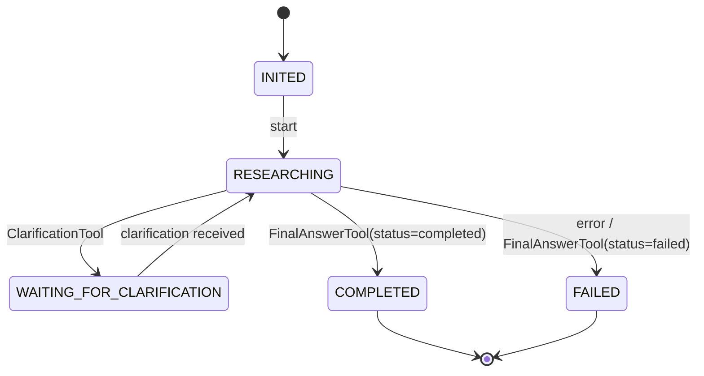
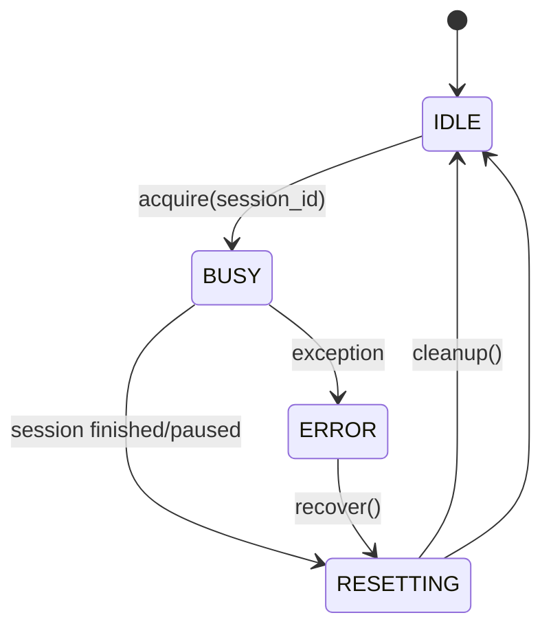

# Документ 2 (v2) — Целевая архитектура (Вариант B) с учётом реального кода `sgr-memory-agent`

> Назначение: дать архитектуру нового проекта, который:
> - сохраняет ядро SGR-Agent (ReAct/SGR/FC) из текущего репозитория,
> - но реализует **persistent lifecycle** (worker-инстансы), **templates**, **tool catalog**, **tool search**, **multi-agent**,
> - и хранит всё в Postgres (с pgvector).

---

## 0) Контекст и ключевой разрыв с текущей реализацией

### Что есть сейчас (критично)
- Agent создаётся per request через `AgentFactory.create()`.
- WAITING_FOR_CLARIFICATION блокирует выполнение через `asyncio.Event.wait()`.
- Tool-инвентарь всегда доступен агенту и вшивается в system prompt (`{available_tools}`), что “съедает” контекст.
- Storage runtime состояния — in-memory dict.

### Что должно стать в Варианте B
- Agent = **долгоживущий worker** (AgentInstance), обслуживающий множество Session’ов.
- Session = отдельная сущность (диалог/задача), хранится в Postgres.
- WAITING = **завершение исполнения session** (без блокировки worker) + ожидание внешнего события (clarification) через DB.
- Набор tools в LLM = **top-k релевантных** через Tool Search Service, а не “всё всегда”.
- Templates/Tools/Policies = хранятся, версионируются и активируются через Admin API.

---

## 1) Компоненты системы (логические сервисы)

### 1.1. Минимальный набор (MVP)
1) **Gateway API** (OpenAI-compatible)
   - `/v1/chat/completions` (stream only)
   - маршрутизация: template name → session create → execution → SSE
   - продолжение: model=session_id → resume session

2) **Runtime (Agent Engine)**
   - AgentInstance pool
   - SessionRunner
   - управление состояниями Session/Instance
   - Tool retrieval + tool execution
   - стриминг событий выполнения

3) **Catalog/Admin API**
   - CRUD Tools
   - CRUD Templates (версионирование)
   - мониторинг Instances/Sessions
   - seed/migrations

4) **Postgres + pgvector**
   - source-of-truth для templates/tools/sessions/messages/tool executions/embeddings

> Физически (deployment) можно начать как “монолит” (один сервис) и позже разделить на 2–3 контейнера; главное — **границы модулей** и контракты между ними.

---

## 2) Основные доменные сущности (DB-first)

### 2.1. Tool (каталог инструментов)
**ToolDescriptor** (версионный):
- `tool_id`, `name`, `version`
- `type`: `system|aux|domain|meta`
- `tags/categories`
- `description_short`, `description_long`
- `input_schema` (JSON Schema, OpenAI function-tool compatible)
- `runtime_binding`:
  - `python_entrypoint` (например `pkg.module:ClassName`)
  - или `remote_endpoint` (HTTP/gRPC)
- `security_policy` (risk level, allow flags, rate limits)
- `embedding` (pgvector)

### 2.2. AgentTemplate (шаблон поведения)
Template — декларативный “AgentDefinition++”:

- `template_id`, `name`, `version`, `is_active`
- `base_agent_class`:
  - `SGRAgent` / `SGRToolCallingAgent` / `ToolCallingAgent` (как в текущем коде)
- PromptPack:
  - `system_prompt` (в идеале **без перечисления всех tools**)
  - `initial_user_request`
  - `clarification_response`
- LLMPolicy:
  - base_url, api_key_ref, model, temperature, max_tokens, streaming settings
- ExecutionPolicy:
  - max_iterations, max_clarifications, max_searches
  - time budgets, tool budgets, stop conditions
- ToolPolicy:
  - required system tools (обязательные)
  - allowlist/denylist по tool_name
  - разрешённые `tool_type/tags`
  - `max_tools_in_prompt` (top-k)
  - `selection_strategy`: `static|retrieval_per_step`
- Rules/Discriminators:
  - правила доступности (как текущие `if iteration >= max_iterations ...`)
  - правила стадий (plan → research → synthesize)
- ResetPolicy:
  - что чистим после session (conversation/context caches)
  - что сохраняем (long-term memory, artifacts)
- MultiAgentMeta:
  - capabilities summary
  - tags
  - embedding (для поиска подходящего агента)

### 2.3. AgentInstance (долгоживущий worker)
- `instance_id`
- pinned `template_id + version`
- `status`: IDLE/BUSY/ERROR/STOPPED
- runtime metadata: node, last_used_at, metrics
- **shared ресурсы**:
  - openai_client (как сейчас создаётся в AgentFactory)
  - коннекторы (Tavily, MCP client factory)
  - кеш tool schemas/entrypoints

### 2.4. Session (конкретная задача/диалог)
- `session_id`
- связь с `template_id/version` и (опционально) `instance_id` последнего исполнения
- `state`: INITED/RESEARCHING/WAITING_FOR_CLARIFICATION/COMPLETED/FAILED/CANCELLED
- `task` (исходный user request)
- `context_snapshot` (аналог `ResearchContext`, но сериализованный)
- `messages` (OpenAI messages)
- `counters`: iteration/searches_used/clarifications_used
- `result` (final answer)
- timestamps

### 2.5. ToolExecution / Artifacts / Sources
- `tool_executions`: tool_name, args, result, status, timing
- `artifacts`: report файлы, логи, ссылки на blob storage
- `sources`: как `SourceData` из текущей модели (url/title/snippet/full_content)

---

## 3) Ключевое изменение исполнения: “agent algorithm” становится re-entrant

Чтобы сохранить текущую логику SGR-Agent (BaseAgent loop), но сделать worker переиспользуемым:

### 3.1. Делим состояние на 2 уровня
1) **Instance-state** (живёт долго)
   - openai_client
   - загруженный template config
   - tool loader / executor
   - (опционально) long-term memory store

2) **Session-state** (живёт в DB, в памяти только на время исполнения)
   - task
   - ResearchContext snapshot
   - conversation/messages
   - streaming channel
   - step log

### 3.2. Обязательное требование: WAITING не блокирует worker
В текущем `BaseAgent.execute()` WAITING реализован как ожидание `Event.wait()`.

В Варианте B меняем поведение:

- если выбран `ClarificationTool`:
  - сохранить в DB:
    - state = WAITING_FOR_CLARIFICATION
    - questions (как tool result)
    - обновлённый context/messages
  - завершить текущий run (exit)
  - вернуть worker в IDLE

Когда приходит clarification:
- обновить session.messages (добавить user clarification template)
- state = RESEARCHING
- запустить `resume(session_id)` на любом свободном worker.

---

## 4) Tool Search Service (экономия контекста)

### 4.1. Где интегрируем в текущие агенты
С учётом кода:

- `PromptLoader.get_system_prompt()` сейчас получает список tools и вшивает `{available_tools}` в system prompt.
- `_prepare_tools()` в `SGRAgent` строит dynamic schema union от списка tools.
- `_prepare_tools()` в ToolCalling/SGRToolCalling использует `pydantic_function_tool`.

В новом дизайне:

- на каждом iteration вызываем `ToolSearchService.get_tools_for_step(...)`
- получаем `selected_tools` (top-k + required system tools)
- используем их:
  - в `_prepare_tools()` (schema/function-tool)
  - (опционально) в system prompt (но лучше избегать полного листинга)

### 4.2. Интерфейс
```text
ToolSearchService.select(
  template: AgentTemplate,
  session: SessionSnapshot,
  query: str,
  top_k: int,
  stage: Optional[str],
  hard_require: list[tool_name],
) -> list[ToolDescriptor]
```

### 4.3. Retrieval-алгоритм (baseline)
1) Сформировать query:
   - task + (optional) last_reasoning.remaining_steps[0] + stage
2) Embedding(query)
3) Vector search по `tools.embedding`
4) Фильтры template policies:
   - allowlist/denylist
   - tool_type/tags
   - security_policy
5) Правила доступности (discriminators):
   - iteration >= max_iterations → keep_only FinalAnswer/CreateReport/Reasoning
   - searches_used >= max_searches → exclude WebSearch/Extract
   - clarifications_used >= max_clarifications → exclude ClarificationTool
6) Добавить required system tools (ReasoningTool/FinalAnswerTool и т. п.)
7) Ограничить до `max_tools_in_prompt`

### 4.4. Контекстная оптимизация (рекомендуемая)
- В **tools metadata** передавать `description` (в текущем коде сейчас пустая строка).
- В system prompt оставить **общие инструкции**, а не список всех tools.
- Для structured output (SGR) стараться держать union schema маленьким (top_k <= 8–12).

---

## 5) Multi-Agent: поиск подходящего агента и делегирование

### 5.1. Agent Directory (поиск template по запросу)
Тот же паттерн retrieval:
- хранить `agent_templates.embedding` по capabilities description
- `AgentDirectory.search(query, top_k)` возвращает несколько templates

### 5.2. Agent-as-Tool
Каждый template может быть представлен как tool:

- `tool_name`: `agent.<template_name>`
- input schema: `{ task: str, constraints?: object }`
- execution: создать session на template и дождаться результата (sync) или вернуть handle (async)

> Для экономии контекста “агент как tool” лучше выдавать LLM **не списком всех агентов**, а через retrieval top-k.

### 5.3. Router (orchestrator)
Поток:
1) получить запрос пользователя
2) agent retrieval → выбрать template
3) получить instance из pool
4) запустить/возобновить session
5) стримить ответ

---

## 6) State Machines (Session + Instance)

### 6.1. Session


### 6.2. AgentInstance


---

## 7) Postgres schema (рекомендуемый baseline)

Рекомендуется Postgres + `pgvector`.

Минимальные таблицы:

- `tools` (versioned, embedding)
- `agent_templates` (versioned, embedding)
- `agent_template_tool_policy` (если нужно хранить explicit allowlist/required)
- `agent_instances`
- `sessions`
- `session_messages`
- `tool_executions`
- `sources`, `session_sources`
- `artifacts`

(Полный SQL/DDL лучше вынести в отдельный документ миграций или alembic.)

---

## 8) Сопоставление с текущим кодом (что будет “модульно” перенесено)

**Переиспользуем:**
- `core/agents/*` как “алгоритмы исполнения” (после рефакторинга session-state)
- `core/tools/*` как tool implementations (через ToolExecutor)
- `core/next_step_tool.py` для SGR structured output
- `core/services/prompt_loader.py` (после переработки tool listing)
- `core/stream.py` как протокол SSE (или как event model)

**Переписываем:**
- `api/endpoints.py` (убираем in-memory agents_storage, делаем DB + runtime)
- `BaseAgent.execute()` — убираем blocking ожидание clarification
- `AgentFactory` — превращаем в Template→Instance builder + tool loader из DB
