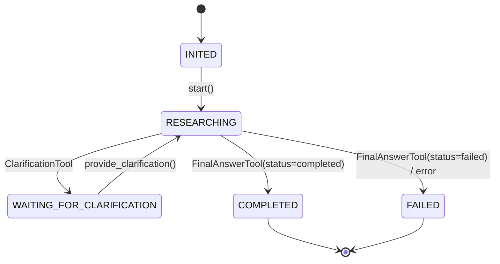
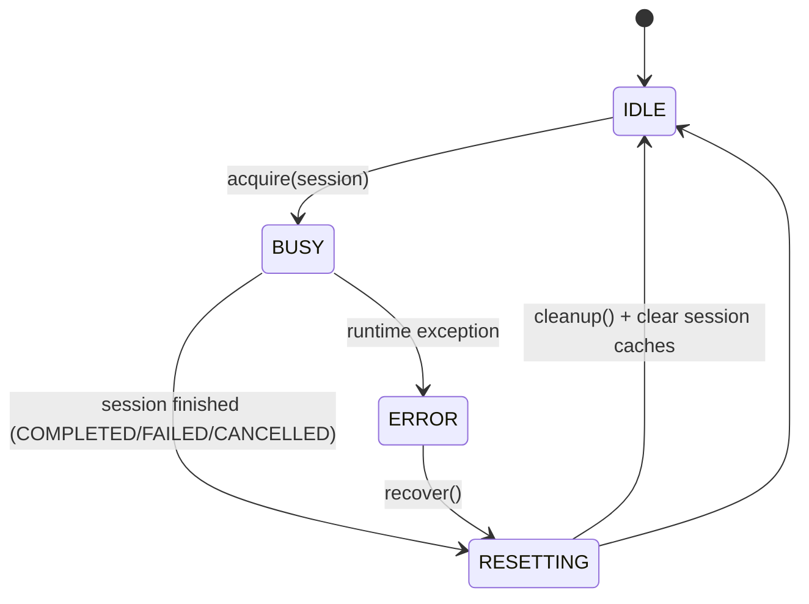

# Документ 2 — Целевая архитектура (Вариант B): Persistent Agent Runtime + Tool Catalog + Tool Search + Templates + Multi-Agent

> Цель: спроектировать новую архитектуру, в которой агент(ы) являются **долгоживущими инстансами** (workers) и могут обслуживать множество запросов/сессий без пересоздания, при этом:
> - поведение агента задаётся шаблоном (Template),
> - инструменты хранятся и описываются централизованно (Tool Catalog),
> - LLM получает **только релевантные** инструменты за счёт Tool Search Service (экономия контекста),
> - все сущности и состояние фиксируются в Postgres,
> - есть интерфейс для multi-agent среды.

---

## 0. Требования и принципы

### 0.1. Must-have требования (из постановки)
1) Полный набор конфигурируемых настроек поведения агента (system prompt, tool-use, лимиты, дискриминаторы и т. п.).
2) Хранение и структурирование tools (базовые/системные, под конкретные задачи).
3) Отдельный сервис/модуль для поиска нужного инструмента под задачу (не грузить LLM всеми tools).
4) Структура БД (Postgres) для хранения шаблонов, инструментов, инстансов, сессий, истории, артефактов.
5) Шаблоны агентов (Agent Template) → создание рабочих инстансов (Agent Instance).
6) Жизненный цикл агента: после завершения сессии **не завершаться**, а переходить в начальное состояние и очищать session-state.
7) Интерфейс/протокол для использования агентов в multi-agent среде (поиск агента под запрос; агент как tool).

### 0.2. Архитектурные принципы
- **Separation of concerns**: runtime ≠ storage ≠ retrieval.
- **OpenAI-compatibility first**: сохранить /v1/chat/completions семантику.
- **Stateless API, stateful runtime**: HTTP слой статeless, состояние в DB + runtime actor.
- **Version everything**: tools и templates должны быть версионны.
- **Policy-driven**: поведение агента определяется декларативно (Template → Policies).
- **Context thrift**: всегда минимизировать payload в LLM (tool subset, сокращённые описания).

---

## 1. Высокоуровневые компоненты

```mermaid
flowchart LR
  subgraph API[API Layer]
    GW[OpenAI-Compatible Gateway]
    ADM[Admin API: templates/tools/instances]
  end

  subgraph RT[Agent Runtime Layer]
    ROUTER[Request Router / Orchestrator]
    POOL[Agent Instance Pool]
    WORKER[Agent Worker (Reusable)]
    SESS[Session Manager]
  end

  subgraph TOOL[Tooling Layer]
    CAT[Tool Catalog Service]
    TSEARCH[Tool Search Service (retrieval)]
    EXEC[Tool Executor]
  end

  subgraph DATA[Data Layer]
    PG[(Postgres + pgvector)]
    BLOB[(Artifacts Storage: FS/S3/minio)]
  end

  GW --> ROUTER
  ROUTER --> POOL
  POOL --> WORKER
  WORKER --> SESS
  WORKER --> TSEARCH
  TSEARCH --> CAT
  CAT --> PG
  SESS --> PG
  EXEC --> PG
  EXEC --> BLOB
  ADM --> PG
```

---

## 2. Ключевые сущности доменной модели

### 2.1. Agent Template (шаблон агента)
**Что это:** декларативное описание поведения агента, на основе которого создаются runtime-инстансы.

**Содержит:**
- идентификатор и версия (`template_id`, `template_version`)
- `base_class` (SGRAgent / ToolCallingAgent / SGRToolCallingAgent / Research* / custom)
- Prompt Pack:
  - `system_prompt`
  - `initial_user_request_template`
  - `clarification_response_template`
  - (опционально) `tool_instruction_overrides`
- LLM Policy:
  - model, temperature, max_tokens, base_url, api_key_ref, etc
  - режим tool-use: FC/SO/hybrid
  - response_format policy
- Execution Policy:
  - max_iterations, max_clarifications, max_searches
  - budgets: timeouts, max_tool_calls, max_context_tokens
  - stop conditions
- Tool Policy:
  - required system tools (минимальный набор)
  - allowed tool categories / tags / explicit allowlist
  - denylist
  - max_tools_in_prompt (жёсткое ограничение top-k)
  - tool selection strategy (static list vs retrieval per step)
- Discriminators / Rules:
  - правила отключения tools по счётчикам/состояниям
  - правила «этапов» (например, planning → searching → synthesis)
- Multi-agent metadata:
  - capabilities description, tags, embedding (для поиска агента)

### 2.2. Agent Instance (runtime worker)
**Что это:** долгоживущий объект/актор, собранный из template и готовый обслуживать сессии.

**Содержит:**
- instance_id
- template_id + version pinned
- runtime status: IDLE/BUSY/STOPPED/ERROR
- shared clients (openai_client, search clients, mcp client) — reuse
- queues/locks для последовательного выполнения сессий
- health metrics (last_used_at, failures)

### 2.3. Session (job/run)
**Что это:** единица работы над конкретным пользовательским запросом (или диалогом до результата).

**Содержит:**
- session_id (в API может совпадать с agent_id, чтобы сохранить совместимость)
- связь с instance_id и template_version
- state machine: INITED/RESEARCHING/WAITING_FOR_CLARIFICATION/COMPLETED/FAILED/CANCELLED
- AgentContext snapshot (JSONB)
- conversation messages (как OpenAI messages)
- tool executions, sources, plan, report artifacts

---

## 3. State Machine: как агент становится «переиспользуемым»

### 3.1. State machine для Session


### 3.2. State machine для Agent Instance (worker lifecycle)


**Ключевой механизм:** после завершения сессии worker делает `cleanup()`:
- очищает conversation/context в памяти (session-state),
- закрывает/обнуляет session-level кеши,
- фиксирует результаты в БД,
- переводится в IDLE.

---

## 4. Tool Catalog: типы, хранение, версионирование

### 4.1. Типы инструментов (структурная классификация)
Рекомендуемая структура:

1) **System / Core tools** (обязательные)
   - ReasoningTool
   - FinalAnswerTool
   - ClarificationTool
   - GeneratePlanTool
   - AdaptPlanTool
   - CreateReportTool

2) **Auxiliary / Capability tools** (общего назначения)
   - WebSearchTool
   - ExtractPageContentTool
   - File/DB access tools (опционально)
   - Summarization, parsing, transformation tools

3) **Domain tools** (под конкретные задачи)
   - Jira/GitLab/GitHub tools
   - CRM tools
   - SQL/BI tools
   - Finance/Legal/HR tools
   - …

4) **Meta tools** (для экономии контекста и multi-agent)
   - ToolSearchTool (если делаем retrieval как tool)
   - AgentSearchTool / AgentDirectoryTool
   - DelegationTool (вызов другого агента как tool)

### 4.2. Что хранить по каждому tool
Tool Descriptor (минимальный набор полей):
- `tool_name` (уникально)
- `type` (system/aux/domain/meta)
- `categories` / `tags`
- `description` (LLM-facing; краткая + расширенная)
- `io_schema`:
  - JSON schema for arguments (совместимо с OpenAI tools)
  - (опционально) output schema / examples
- `python_entrypoint` (dotted path) или `container_endpoint` (если tool удалённый)
- `security_policy`:
  - risk level
  - allow_in_prod / allow_in_dev
  - rate limits
- `embedding` (pgvector) для retrieval
- `version`, `is_active`, `deprecation` flags

---

## 5. Tool Search Service (экономия контекста)

### 5.1. Задача сервиса
Сформировать **меньший** набор инструментов, которые реально нужны LLM в текущем шаге, вместо передачи «всех tools всегда».

### 5.2. Интерфейс
```text
ToolSearchService.search(
  query: str,
  template_id: UUID,
  session_state: SessionStateSnapshot,
  top_k: int,
  filters: {tool_types, categories, allowlist, denylist, risk_level, ...}
) -> List[ToolDescriptor]
```

### 5.3. Алгоритм (рекомендуемый baseline)
1) Сформировать retrieval query:
   - task/user request + (опционально) current reasoning/next_step
2) Получить embedding запроса.
3) Поиск в `tool` по cosine distance (pgvector).
4) Фильтрация:
   - template allowlist/denylist
   - tool availability rules (max_iterations/max_searches/max_clarifications и др.)
   - environment policies
5) Пост-обработка:
   - всегда добавить required system tools
   - добавить «инструменты-обязательные по этапу» (например, в начале GeneratePlanTool)
   - ограничить итоговый набор до `max_tools_in_prompt`
6) Стабилизация:
   - кэшировать результат (template_id + query hash + tool versions) на время сессии
   - при необходимости делать rerank (LLM rerank, BM25 + embeddings)

### 5.4. Вариант с «tool как retrieval»
Можно сделать ToolSearchService доступным агенту как один системный tool (например, `tool_search`) и позволить LLM самой запрашивать нужные инструменты. Но базовый вариант надёжнее: retrieval снаружи, LLM видит уже отфильтрованный список.

---

## 6. Хранилище (Postgres): рекомендуемая структура

### 6.1. Расширения
- `pgcrypto` (UUID/crypto)
- `pgvector` (embeddings)
- `uuid-ossp` (опционально)

### 6.2. Таблицы (минимальный набор)

#### tools
- `tool_id UUID PK`
- `tool_name TEXT UNIQUE`
- `tool_type TEXT` (system/aux/domain/meta)
- `category TEXT` (или FK)
- `description_short TEXT`
- `description_long TEXT`
- `json_schema JSONB` (arguments schema)
- `python_entrypoint TEXT NULL`
- `remote_endpoint TEXT NULL`
- `security_policy JSONB`
- `embedding VECTOR(1536)` (пример)
- `version INT`
- `is_active BOOL`
- `created_at, updated_at`

#### agent_templates
- `template_id UUID PK`
- `name TEXT UNIQUE`
- `description TEXT`
- `base_class TEXT`
- `llm_config JSONB`
- `execution_policy JSONB`
- `tool_policy JSONB`
- `prompt_pack JSONB`
- `multiagent_meta JSONB`
- `embedding VECTOR(...)`
- `version INT`
- `is_active BOOL`
- timestamps

#### agent_template_tools (M:N)
- `template_id UUID FK`
- `tool_id UUID FK`
- `role TEXT` (required/optional)
- `constraints JSONB`
- PK(template_id, tool_id)

#### agent_instances
- `instance_id UUID PK`
- `template_id UUID FK`
- `template_version INT`
- `status TEXT` (IDLE/BUSY/STOPPED/ERROR)
- `runtime_node TEXT`
- `created_at, last_used_at`
- `meta JSONB`

#### sessions
- `session_id UUID PK`
- `instance_id UUID FK`
- `template_id UUID FK`
- `template_version INT`
- `state TEXT`
- `task_messages JSONB`
- `context JSONB`
- `iteration INT`
- `searches_used INT`
- `clarifications_used INT`
- `created_at, started_at, finished_at, updated_at`

#### session_messages
- `id BIGSERIAL PK`
- `session_id UUID FK`
- `seq INT`
- `role TEXT`
- `content JSONB` (поддержать multimodal как в OpenAI)
- `tool_call_id TEXT NULL`
- `created_at`

#### tool_executions
- `id BIGSERIAL PK`
- `session_id UUID FK`
- `iteration INT`
- `tool_id UUID FK`
- `tool_name TEXT`
- `arguments JSONB`
- `result JSONB`
- `status TEXT` (ok/error)
- `error TEXT NULL`
- `started_at, finished_at`

#### sources (опционально, но полезно для research)
- `source_id UUID PK`
- `url TEXT`
- `title TEXT`
- `snippet TEXT`
- `content TEXT`
- `meta JSONB`
- `created_at`

#### session_sources (M:N)
- `session_id UUID FK`
- `source_id UUID FK`
- `ordinal INT`
- PK(session_id, source_id)

#### artifacts
- `artifact_id UUID PK`
- `session_id UUID FK`
- `type TEXT` (report/log/etc)
- `uri TEXT` (fs/s3)
- `meta JSONB`
- `created_at`

---

## 7. Multi-Agent: поиск агента и «агент как tool»

### 7.1. Agent Directory (поиск подходящего агента)
Храним метаданные шаблона агента:
- описание capability
- теги
- embedding

Тогда поиск агента — тот же retrieval:
```text
AgentDirectory.search(query, top_k) -> templates[]
```

### 7.2. Agent-as-Tool (делегирование)
Каждый агент-шаблон можно экспонировать как tool:
- `tool_name`: `agent.<template_name>`
- `description`: capability summary
- input schema: { "task": "...", "context": ..., "constraints": ... }
- output: текст/JSON

Технически это wrapper, который:
- создаёт session для target agent template
- стримит/возвращает результат
- (опционально) возвращает citations/артефакты

### 7.3. Оркестратор (Router)
Router получает исходный запрос и:
1) делает agent retrieval (или rule-based выбор),
2) выделяет worker из pool,
3) запускает session,
4) возвращает streaming,
5) освобождает worker после finish.

---

## 8. Совместимость с OpenAI API

### 8.1. Сохранить существующий контракт
- `/v1/chat/completions` остаётся главным endpoint’ом
- `model` принимает:
  - template name (как раньше «sgr-agent»),
  - либо session_id/agent_id для продолжения (как сейчас)
- streaming SSE формат совместим с OpenAI client

### 8.2. Дополнительные endpoints (admin)
- CRUD шаблонов: `/admin/templates/*`
- CRUD инструментов: `/admin/tools/*`
- управление пулом: `/admin/instances/*` (опционально)
- метрики: `/metrics`

---

## 9. Deployment и масштабирование (baseline → scalable)

### 9.1. MVP (single-node)
- 1 FastAPI процесс
- AgentPool in-memory
- Postgres как единственный state store
- tool search через pgvector

### 9.2. Scale-out
- несколько runtime node’ов
- распределение sessions по node’ам (через DB-lock или очередь)
- опционально Redis/Queue для job dispatch

---

## 10. Риски и контрмеры

1) **Race conditions** при параллельном доступе к session/instance → транзакции + optimistic locking.
2) **Memory leaks** в worker → строгий cleanup/reset после каждой сессии.
3) **Непредсказуемость retrieval** → включить required system tools, fallback на базовый allowlist.
4) **Безопасность domain tools** → security policy, allowlist, sandboxing.

---

Конец документа.
